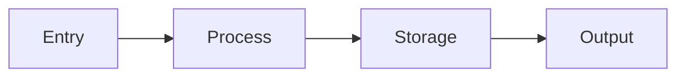

# Context Skill

Standardize any project for Claude Code by creating `claude_code_context/` directory with comprehensive project documentation.

---

## Usage

| Command | Description |
|---------|-------------|
| `init` | Full setup: create all context areas + update CLAUDE.md |
| `update [area]` | Refresh specific area (git, code, test, pkgm, lint, dev, features) |
| `add [area]` | Add new context area or feature doc |
| `status` | Show which areas exist and their freshness |

---

## Context Structure

> **Note:** This is a reference structure. Add/remove folders and files based on your project's needs. Each level can have additional subdirectories.

```
claude_code_context/
├── git/
│   ├── commits.md      # Commit message patterns
│   ├── branches.md     # Branch naming conventions
│   ├── cicd.md         # CI/CD patterns and workflows
│   └── ...             # pr-templates.md, release.md, etc.
├── code/
│   ├── standards.md    # Coding standards, naming, principles
│   ├── patterns/       # Unit-specific patterns
│   │   ├── views.md | controllers.md | handlers.md
│   │   ├── models.md | entities.md | schemas.md
│   │   ├── services.md | use-cases.md
│   │   ├── components.md | widgets.md
│   │   ├── utils.md | helpers.md
│   │   └── ...         # Add patterns for your project's units
│   └── ...             # architecture.md, api-design.md, etc.
├── test/
│   ├── standards.md    # Testing principles
│   ├── patterns/       # Test type patterns
│   │   ├── unit.md | integration.md | e2e.md
│   │   ├── factories.md | fixtures.md
│   │   ├── mocks.md | stubs.md
│   │   └── ...         # Add patterns for your test types
│   └── ...             # coverage.md, ci-testing.md, etc.
├── pkgm/
│   ├── package-manager.md  # Install, add, remove, audit, resolve
│   └── ...             # dependencies.md, monorepo.md, etc.
├── lint/
│   ├── linting.md      # Run lint/format, skip rules, trade-offs
│   └── ...             # pre-commit.md, editor-config.md, etc.
├── dev/
│   ├── setup.md        # Docker, env setup, local dev
│   └── ...             # debugging.md, profiling.md, etc.
├── features/
│   ├── [feature-name].md  # Feature docs with mermaid
│   └── ...             # Add docs for each major feature
└── ...                 # Add more top-level areas as needed
```

---

## Step 1: Analyze Project

Discover project structure and tooling:

```
Glob: package.json, requirements.txt, pubspec.yaml, Cargo.toml, go.mod
Grep: test patterns, linting configs
Read: CLAUDE.md, README, existing docs
Bash: git log --oneline -20, git branch -a
```

Identify:
- **Language/Framework**: Django, Next.js, Flutter, Rails, etc.
- **Package manager**: npm, yarn, pnpm, pip, poetry, pub, cargo
- **Test framework**: pytest, jest, flutter_test, rspec
- **Linter**: eslint, ruff, pylint, dart analyze

---

## Step 2: Generate Context Files

> **CRITICAL: Verify before documenting.** Only document patterns that actually exist in the codebase. Before writing any standard:
> 1. Use Glob/Grep to find real examples
> 2. If no examples found → don't document that pattern
> 3. If only 1-2 examples → mention it's rarely used
> 4. Extract from actual code, never invent ideal patterns

### git/commits.md
```markdown
# Commit Message Patterns

## Format
[Analyze git log to determine actual format used]

## Types (only include types found in git log)
[Run: git log --oneline -50 | grep -oE "^[a-f0-9]+ [a-z]+:" | cut -d: -f1 | sort | uniq -c]
[List only types that appear multiple times]

## Examples (from this repo)
[Extract 3-5 real examples from git log]
```

### git/branches.md
```markdown
# Branch Naming

## Pattern
[Run: git branch -a | grep -v HEAD | head -20]
[Analyze to determine actual pattern used]

## Types (only include prefixes found in branches)
[List only prefixes that appear in actual branches]

## Examples (from this repo)
[Extract from git branch -a]
```

### code/standards.md
```markdown
# Coding Standards

## Naming
[Use Glob to find file patterns, Grep to find class/function naming]
[Only document patterns with 3+ occurrences]

## Principles
[Search for actual patterns in code - don't assume DRY/SOLID]
[Look for: base classes, mixins, shared utils, repeated structures]

## Imports
[Read 5-10 files, extract actual import ordering/grouping]

## Error Handling
[Grep for try/catch, raise, throw - document what's actually used]
```

### test/standards.md
```markdown
# Testing Standards

## File Naming
[Glob for test files: *test*, *spec* - document actual patterns found]

## Test Naming
[Grep for def test_, it(", describe(" - extract actual naming patterns]

## Structure
[Read 3-5 test files - document actual structure used, not ideal]

## Fixtures/Factories
[Glob for fixture/factory files - only document if they exist]
```

---

## Step 3: Update CLAUDE.md

Add this section to CLAUDE.md:

```markdown
## Project Context

This project uses `claude_code_context/` for AI-assisted development standards.

### How to Use

Before writing or editing code, **explore `claude_code_context/`** to find relevant context:
- Browse subdirectories to understand what's documented
- Read files related to your current task (coding, testing, git, etc.)
- Follow patterns and conventions described in those files

```bash
# Quick way to see what's available
find claude_code_context -name "*.md" | head -20
```

### Keeping Context in Sync (IMPORTANT)

CLAUDE.md and claude_code_context/ must stay in sync. Follow these rules:

**When updating claude_code_context/:**
- If you add/remove/rename context files → update this section to reflect changes
- If you change how a context area works → update the relevant "Before X" section above

**When updating CLAUDE.md (context-related sections):**
- If you add new conventions here → create corresponding file in claude_code_context/
- If you change guidance here → update the matching claude_code_context/ file

**Why this matters:**
- CLAUDE.md = quick reference and entry point
- claude_code_context/ = detailed patterns and examples
- Both must agree, or AI assistants will get confused
```

---

## Step 4: Create Feature Docs

For each major feature, create `features/[name].md`:

```markdown
# [Feature Name]

## Overview
[1-2 sentences]

## Data Flow



## Key Files
- Entry: `path/to/entry.py`
- Core: `path/to/core.py`
- Data: `path/to/models.py`

## Related
- [Other features that interact]
```

---

## Principles

1. **Extract, don't invent** - Document what exists, not ideal patterns
2. **Verify before documenting** - Use Glob/Grep to confirm patterns actually exist in codebase
3. **Concise over complete** - Code and tests are the real docs
4. **Mermaid for flows** - Visualize complex interactions
5. **Two-way sync** - CLAUDE.md ↔ claude_code_context/ must stay in sync (not everyone has the plugin)
6. **Fresh context** - Run `update` when patterns evolve

---

## Available Subagents & Skills

When running as agent, you have access to:
- All dev skills (ask, debug, describe, dive, domain, refactor, tdd, pattern-matcher)
- All explore/research subagents
- Bash tools: git, find, ls, cat
- All MCP tools available in the session

Use appropriate tools for each discovery task.

---

*This skill covers the essentials. Adapt to each project's unique structure.*
