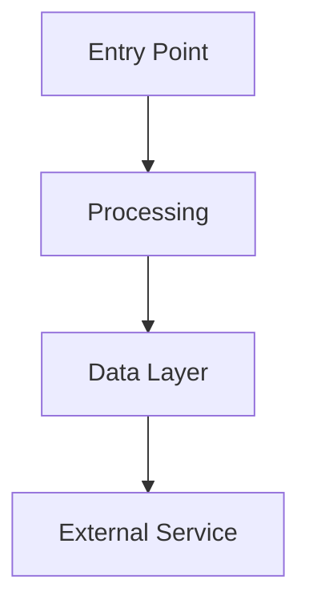
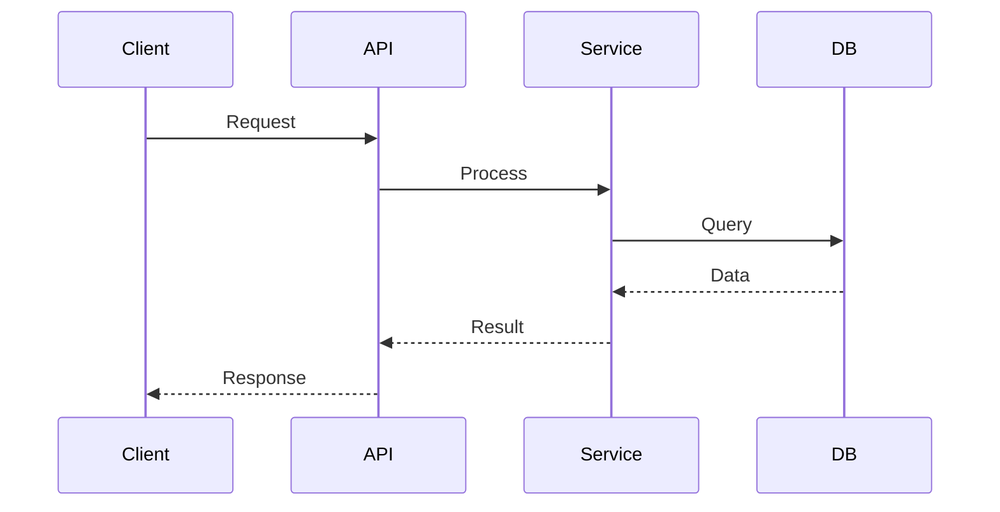
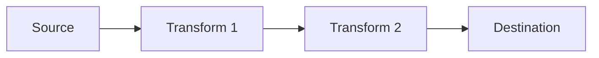

# Describe Skill

Generate comprehensive documentation for any part of the codebase.

---

## Step 1: Clarify Output Requirements

**Ask the user:**

1. **What to describe?**
   - Feature/module overview
   - Single unit (class, function, component)
   - Data flow (request → response)
   - Architecture layer
   - Integration with external service

2. **Output format preference?**
   - Text-heavy explanation
   - Diagram-focused (mermaid)
   - API reference style
   - Tutorial/how-to style

3. **Audience?**
   - New team member (explain everything)
   - Experienced developer (focus on gotchas)
   - Non-technical stakeholder (high-level)

4. **Output location?**
   - `docs/[name].md`
   - `domain_knowledge/[category]/[name].md`
   - Inline response (no file)

---

## Step 2: Research the Target

Use appropriate search based on target type:

### Feature/Module
```
Glob: Find all files in the module
Grep: Find entry points, exports
Read: Main files, configs
```

### Single Unit
```
Read: The specific file
Grep: Find all usages/callers
Grep: Find all dependencies
```

### Data Flow
```
Grep: Find entry point (route, handler)
Read: Trace through each step
Grep: Find exit points (response, side effects)
```

---

## Step 3: Generate Documentation

### Template: Feature Overview

```markdown
# [Feature Name]

## Overview
[2-3 sentence summary]

## Architecture



## Key Components

### [Component 1]
- **Location:** `path/to/file.py`
- **Purpose:** [What it does]
- **Key methods:** `method1()`, `method2()`

## Data Flow



## Configuration
[Environment variables, settings]

## Related
- [[related-feature]]
- [[dependency]]
```

### Template: Single Unit

```markdown
# [Unit Name]

**File:** `path/to/file.py:line`

## Purpose
[What this unit does]

## Signature
```python
def function_name(arg1: Type1, arg2: Type2) -> ReturnType:
```

## Parameters
| Name | Type | Description |
|------|------|-------------|
| arg1 | Type1 | [description] |

## Returns
[Description of return value]

## Example
```python
result = function_name(arg1, arg2)
```

## Used By
- `path/to/caller1.py:45`
- `path/to/caller2.py:89`

## Dependencies
- `some_module.helper()`
- `external_service.api`
```

### Template: Data Flow

```markdown
# Data Flow: [Flow Name]

## Overview
[Summary of what data flows and why]

## Flow Diagram



## Steps

### 1. [Step Name]
- **Location:** `file.py:line`
- **Input:** [data shape]
- **Output:** [data shape]
- **Transformation:** [what changes]

### 2. [Step Name]
...

## Error Handling
[What happens when things fail]

## Side Effects
[Database writes, external calls, etc.]
```

---

## Step 4: Add Mermaid Diagrams

Use appropriate diagram type:

| Use Case | Diagram Type |
|----------|--------------|
| Component relationships | `graph TD` |
| Request/response flow | `sequenceDiagram` |
| State transitions | `stateDiagram-v2` |
| Process steps | `flowchart LR` |
| Class structure | `classDiagram` |
| Timeline/phases | `gantt` |

---

## Step 5: Save Output

Save to appropriate location:
- Feature docs: `docs/features/[name].md`
- Technical docs: `docs/technical/[name].md`
- Domain knowledge: `domain_knowledge/[category]/[name].md`

Include timestamp:
```markdown
---
Generated: YYYY-MM-DD
Author: Claude Code
---
```

---

*This skill covers more than listed. Apply these principles broadly.*
