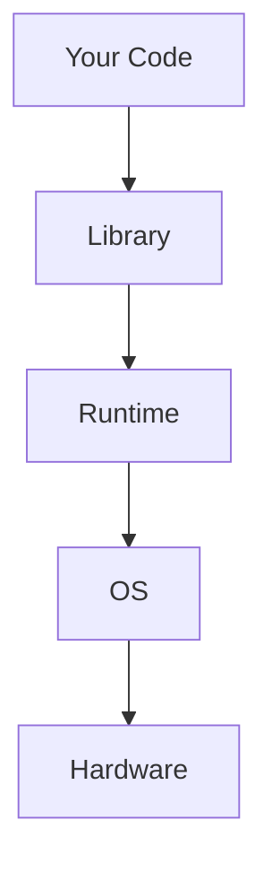

# Dive Skill

Go beneath the surface. Understand what's really happening under the hood.

---

## Step 1: Clarify Dive Depth

**Ask the user what level they want:**

| Level | Description | Example |
|-------|-------------|---------|
| **1 - Framework** | How the framework handles it | Django ORM query execution |
| **2 - Library** | Internal library implementation | How `requests` manages connections |
| **3 - Language** | Python/JS/Dart internals | How `async/await` works |
| **4 - Runtime** | VM/interpreter behavior | V8 event loop, Python GIL |
| **5 - System** | OS/kernel level | File descriptors, syscalls |
| **6 - Hardware** | CPU/memory/network | Cache lines, TCP packets |

**Default:** Start at Level 1, offer to go deeper.

---

## Step 2: Research Approach

### Level 1-2: Framework/Library

```
Read: Project code using the feature
WebSearch: "[framework] [feature] internals"
WebFetch: Official documentation, source code links
```

### Level 3-4: Language/Runtime

```
WebSearch: "[language] [feature] implementation"
WebFetch: Language specification, runtime documentation
WebSearch: "[runtime] source code [feature]"
```

### Level 5-6: System/Hardware

```
WebSearch: "[feature] syscall linux"
WebSearch: "[feature] kernel implementation"
WebSearch: "[topic] CPU architecture"
WebFetch: Man pages, kernel docs, hardware specs
```

---

## Step 3: Dive Categories

### Database Queries
- **L1:** ORM query building
- **L2:** Database driver protocol
- **L3:** Connection pooling internals
- **L4:** Query parsing, execution plan
- **L5:** Filesystem I/O, page cache
- **L6:** Disk sectors, SSD cells

### HTTP Requests
- **L1:** HTTP client library usage
- **L2:** Connection management, keep-alive
- **L3:** Socket abstraction
- **L4:** SSL/TLS handshake
- **L5:** TCP state machine, syscalls
- **L6:** Network packets, NIC buffers

### Async/Concurrency
- **L1:** async/await syntax
- **L2:** Event loop implementation
- **L3:** Coroutine/generator internals
- **L4:** Thread scheduling, GIL
- **L5:** OS threads, context switching
- **L6:** CPU cores, hyperthreading

### Memory/Data Structures
- **L1:** High-level data structures
- **L2:** Implementation (hash tables, trees)
- **L3:** Memory allocation patterns
- **L4:** Garbage collection
- **L5:** Virtual memory, page tables
- **L6:** RAM timing, cache hierarchy

---

## Step 4: Output Format

```markdown
# Deep Dive: [Topic]

**Depth:** Level [N] - [Description]

## The Question
[What we're investigating]

## Surface Level (What You See)
```python
# The code you write
response = requests.get(url)
```

## Layer 1: [Framework/Library]
[Explanation with code references]

## Layer 2: [Deeper Layer]
[Explanation]

## Layer 3: [Even Deeper]
...

## Key Insights
- [Insight 1 - why this matters]
- [Insight 2 - performance implication]
- [Insight 3 - common pitfall]

## Diagram



## Further Reading
- [Link to source code]
- [Link to documentation]
- [Link to specification]
```

---

## Step 5: Offer to Go Deeper

After each level, offer:

> "Would you like to go deeper into [specific aspect]? I can explain:
> - [Option 1 - one level deeper]
> - [Option 2 - related topic]
> - [Option 3 - practical implications]"

---

*This skill covers more than listed. Apply these principles broadly.*
